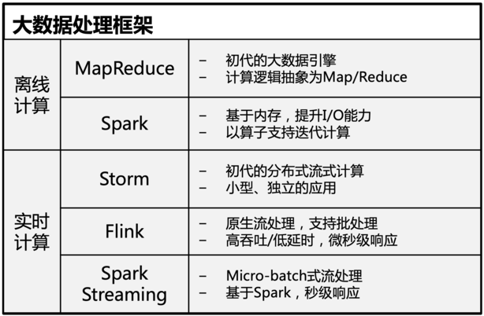
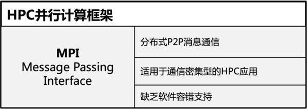

# Scalebox - 一种云原生的流式计算引擎

Scalebox是一种云原生的流式计算引擎，可在分布式、异构计算集群上运行容器化的单机用户算法，通过流水线组织模块层级上的大规模并行处理，支持任务级容错。与已有大数据处理、并行计算等框架相比，其技术特点特别适用于数据分布、算力资源分布、算法复杂等应用场景。

scalebox具有以下特性：
- **云原生设计**：所有算法模块、传输模块等都采用容器化封装，数据处理流水线面向云环境设计；软件基础平台也完全基于云原生设计实现；平台支持用户单机算法的大规模并行化，前后模块间通过消息总线关联，实现非侵入式并行编程，大大简化计算过程的并行化难度。
- [**跨集群计算**](./tests/cross-cluster-primes/)：算法模块、传输模块的的归一化处理，通过流水线统一处理集群内/跨集群的数据，屏蔽跨集群的数据和计算的差别；跨集群消息驱动，实现流式处理，支持单流水线应用在多个异构算力集群上的部署。
- [**任务级容错**](./tests/retry_test/)：对于硬件故障、软件bug、网络问题、数据异常等原因导致的偶发性出错，支持基于规则的自动容错处理；细粒度的任务级容错，可为在不可靠硬件上运行可靠的数据分析创造条件。
- **位置感知调度**：消息体内可包含发送端IP地址，使得前后模块间可实现本地级联处理；将处理层、存储层分离，降低耦合，水平方向（处理层）的消息驱动垂直方向（处理层到存储层）的数据读写，降低计算集群内东西向网络流量，消除集群存储I/O瓶颈；进而实现无共享存储的本地计算，大文件可实现纯本地加载，，有效支持横向扩展。
- [**任务透视**](./tests/task-exec-files/)：计算任务为消息驱动型，计算任务执行过程即为消息处理过程；任务透视详细纪录每个任务的用户程序返回码、标准输出、标准错误、程序定义返回文本、用户程序读写字节数等，此外还包括任务执行全生命周期（消息产生、消息分发、消息处理、结果纪录）的多个时间戳，含计算容器端、控制端共有近20个，还支持任意数量的用户定制时间戳。任务透视支持问题排查中的精准定位，并为流水线应用的优化提供基础数据支持。
- **多并行化方式**：主要包括：模块内算法并行，模块级数据并行，模块间流水线并行
- **多计算后端**：多种计算集群类型（自管理集群、HPC集群、k8s容器集群等）；多种容器引擎（docker、[singularity](./tests/hello-scalebox-singularity/)、k8s）

本仓库包含以下内容：

1. 基于docker-compose的scalebox服务端环境（[服务环境](https://github.com/kaichao/docker-scalebox/server/README.md)）
2. scalebox标准模块的Dockerfile定义 ([标准模块](https://github.com/kaichao/docker-scalebox/dockerfiles/README.md))
3. scalebox的应用示例（[应用示例](https://github.com/kaichao/docker-scalebox/examples/README.md)）
4. scalebox的主要特性的测试（[特性测试](https://github.com/kaichao/docker-scalebox/tests/README.md)）

## 内容列表

- [Scalebox - 一种云原生的流式计算引擎](#scalebox---一种云原生的流式计算引擎)
  - [内容列表](#内容列表)
  - [研究背景](#研究背景)
  - [环境安装](#环境安装)
  - [使用说明](#使用说明)
    - [单节点集群](#单节点集群)
    - [多节点集群](#多节点集群)
  - [应用示例](#应用示例)
  - [特性测试](#特性测试)
  - [相关软件](#相关软件)
  - [维护者](#维护者)
  - [如何贡献](#如何贡献)
  - [使用许可](#使用许可)

## 研究背景

传统计算框架包括大数据处理框架、HPC并行计算框架两大类。

大数据处理框架有分为离线计算（批处理）、实时计算（流式处理）。下表列出了主流大数据计算框架的比较：



HPC并行计算框架是支持超级计算机上高性能计算应用的计算框架，最常见的是MPI。下表列出了MPI的主要特性：


当前，各类应用的数据规模越来越大，以大规模天文观测为代表科学应用，其具有以下应用特点：
- 数据规模：
- 数据分布：
- 算力分布：
- 算法复杂：

针对以上需求，传统的大数据处理框架、HPC并行计算框架都存在不足。以下从几个主要特性上进行总结：

|        | 大数据处理框架  | HPC并行计算框架 | 应用需求 |
|  ----  | ----  | ----  | ----  |
| 程序并行化  | - 需调整应用逻辑 | - 需调整应用逻辑<br>- 编程技巧要求高 | - 应用中可能使用开源组件，修改难度大<br>- 传统计算框架的并行化对用户要求高 |
| 跨集群计算  | - 不支持 | - 不支持 | - 大规模复杂应用，数据分布式产生<br>- 复杂计算计算资源需求多样，单一集群不能满足，需跨集群计算 |
| 容错支持  | - 框架支持 | - 框架不支持<br>- 应用自身通过checkpoint实现 | - 大规模复杂计算，容错是必需的 |
| 高I/O加载  | - 集群文件系统<br>- data locality支持 | - 并行文件系统| - 大规模复杂应用，I/O需求较大，集群存储可能成为瓶颈<br>- 直接访问本地存储/内存缓存，将大大提升效率 |

面向以上应用需求，研发计算框架，将简化以上场景应用的软件研发。

## 环境安装

- 操作系统
  - CentOS 7+（其他Linux版本待测试）
  - macos 10.15+(amd64)（ARM版待测试）

macos主要用于单节点集群的开发测试。

详细安装参见：[服务环境](server/README.md)

## 使用说明

### 单节点集群
单节点集群常用于测试、开发。

- 安装单机版系统环境
- 测试应用示例（hello-scalebox、app-primes）
- 基于标准模块，参照标准应用实例，构建自己的应用实例
- 定制自己的应用模块，并构建应用案例

### 多节点集群
多节点集群常用于生产环境。

- 在单节点集群基础上，参照```bio-down```集群定义，定义自己的内联集群
- 在应用定义文件，引用多节点集群的资源


## [应用示例](examples/)

scalebox应用的初级示例，包括：
- [hello-scalebox](examples/hello-scalebox/)：scalebox的第一个入门应用
- [app-primes](examples/app-primes/)：计算区间内质数总数量
- [app-copy](examples/app-copy/)：演示最常用的跨集群数据拷贝


## [特性测试](tests/)

- 容错支持：[retry_test](tests/retry_test/)
- 超时设置：[timeout-gen](tests/timeout-gen/)
- 流控管理：[check_test](tests/check_test/)
- 应用交互：[task-exec-files](tests/task-exec-files/)


## 相关软件

- [PostgreSQL Database Management System](https://github.com/postgres/postgres) — scalebox后台数据库
- [gRPC – An RPC library and framework](https://github.com/grpc/grpc) — 不同软件模块间的高效通信协议
- [The Go Programming Language](https://github.com/golang/go) — 云原生应用的程序语言
- [Pony ORM ER Diagram Editor](https://editor.ponyorm.com/) - 神奇的ER图工具

## 维护者

[@kaichao](https://github.com/kaichao)

## 如何贡献

非常欢迎你的加入！[提一个 Issue](https://github.com/kaichao/docker-scalebox/issues/new) 或者提交一个 Pull Request。


## 使用许可

[Apache License](LICENSE) © Kaichao Wu
