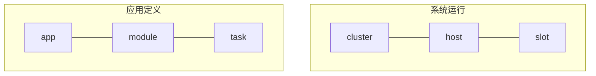

# 1. 技术规范参考

Scalebox应用是运行在Scalebox平台上的应用程序。典型的Scalebox应用程序包括高通量数据处理、大规模数据传输等。

## 1.1 应用定义规范（app.yaml完整schema）

应用定义文件是用于定义Scalebox应用程序（App）及其模块（Module）的yaml文本文件，还支持集群（Cluster）。

应用定义文件的格式示例如下：

```yaml
name: perf-test.my-app
label: perf-test
version: 1.0.0
cluster: ${CLUSTER}
parameters:
  initial_status: RUNNING
  main_router: main-router
  is_cluster_admin: yes
  default_sleep_count: 20
  comment: This is a sample app.

modules:
  module-1:
    arguments:
      ...
    parameters:
      ...
    ...
  module-2:
    ...

clusters:
  cluster-1:
    ...
  cluster-2:
    ...


```

应用定义文件分为主配置属性、module定义、cluster定义等部分。

若应用定义文件仅用于cluster的定义，则主配置下的所有属性不生效。

应用定义文件的缺省名为当前目录下的app.yaml。

关于主配置下的字段说明如下：
- *name*: 应用名称，通常用点分的标识符构成
- *label*: 在系统中显示的应用名，通常可以用中文标识。
- *version*: 应用版本号
- *cluster*: 应用中所有module的的缺省集群名
- *comment*: 注释信息
- *parameters*: 应用的参数列表
  - *initial_status*：应用的初始状态，取值为：'RUNNING'/'INITIAL'。若设为‘RUNNING’，则App创建后，直接进入运行状态；
  - *main_router*：指定应用中模块的缺省路由。若模块的后续模块（sink-module）为空，则为该模块指定main-router指定为后续模块；
  - *default_sleep_count*: 所有module的缺省max_sleep_count参数，缺省值为100（6秒为1个单位，计10分钟）

关于module、cluster的详细定义，见后续章节。


- 应用定义文件中的模板参数文件

除虚拟模板参数CLUSTER_DATA_DIR之外，模板变量必须先定义，再使用。以下是模板变量定义及优先排序（从低到高）
- ```/etc/scalebox/environments```
- ```${HOME}/.scalebox/environments```
- ```${PWD}/scalebox.env```
- ```${PWD}/${{env-defined}}.env```
- ```${PWD}/${{env-defined}}_${{app-defined}}.env```
- 当前命令行中，已定义的环境变量


## 1.2 模块定义规范

```yaml
  my-module:
    label: My First Module
    base_image: scalebox/agent
    cluster: my-cluster
    command: docker run -d --network=host {{ENVS}} {{VOLUMES}} {{IMAGE}}
    arguments:
      ...
    parameters:
      ...
    environmens:
      ...
    volumes:
      ...
    slots:
      ...
    sink_modules:
      ...
    sink_vmodules:
      ...
    comment: This is new algorithm module.

```

关于Module的字段说明如下：
- *label*: 应用界面中显示的Module
- *base_image*: 容器镜像名
- *cluster*: 集群名
- *command*: 容器运行的命令模板
- *arguments*: 容器端的标准变量，通常映射为环境变量
        ...
- *parameters*: 模块的服务端参数
        ...
- *environmens*: 环境变量
        ...
- *volumes*: 物理路径，通过volume映射
        ...
- *slots*: 模块的slot定义
        ...
```yaml
  slots:
    - ${nodes}[:n]
    - ${nodes}:${n}:${group_prefix}
```
第二行，用于host-bound场景下全局/分组slot定义。
- nodes为slot所在节点
- n为slot数量
- 分组前缀的正则表达式
分组slot的parameters中，设定group_prefix为组前缀

- *sink_modules*: 标识Module间的物理关联，在跨集群应用中，用于标识跨集群的Module间的关联；
        ...
- *sink_vmodules*（串数组）: 用于Module间的逻辑关系。

## 1.3 集群定义规范

cluster定义的示例如下：

```yaml
  mycluster:
    label: My new clster
    parameters:
      uname: myuser
      port: 10022
      base_data_dir: /global-fs/scalebox/mydata
      local_ip_index: 2
      num_of_executors: Inline cluster only
      channel_size: channel size fo executor, Inline cluster only
      grpc_server: 192.168.3.123:50051
    total_resources:
      num_cores: cpu cores
      total_mem_gb:
      total_disk_tb:
    status: ON
    comment:

```

- *label*:
- *parameters*:
  - *port*: 主机的缺省端口号
  - *uname*: 主机的缺省用户名
  - *base_data_dir*: 集群的数据目录
  - *local_ip_index*: 用于提取本机IP地址的索引号（hostname -I）
  - *grpc_server*:	?有一个相同名称的外部字段。
  - *remote_grpc_server*:
  - *pghost*:
  - *remote_pghost*:

## 1.4 标识符命名规则
### 1.4.1	文件名命名规则
文件名字符：数字、英文字母大小写、下划线、点。
### 1.4.2	URI命名规则
App、Module等资源通过URI（Uniform Resource Identifier，统一资源标识符）作唯一标识。常见的URI主要包括URL（Uniform Resource Locator，统一资源定位符）、URN（Uniform Resource Name，统一资源名称）两大类。URI 指的是一个资源，URL 指的是用地址定位一个资源，URN 指的是用名称定位一个资源。 即URL 和 URN 是 URI 的子集。
App、Module等通过URN来定义。

### 1.4.3	版本号命名规则
App、Module等资源类型可以通过版本表示，版本定义遵循语义化版本.
版本格式如下：主版本号.次版本号.修订号，版本号递增规则如下：
·	主版本号：当你做了不兼容的 API 修改，
·	次版本号：当你做了向下兼容的功能性新增，
·	修订号：当你做了向下兼容的问题修正。

先行版本号及版本编译元数据可以加到“主版本号.次版本号.修订号”的后面，作为延伸。


2.1 术语定义

Scalebox的主要术语类型分为：应用定义（app/module/task）、系统运行（cluster/host/slot）两类。如下图所示：


- 应用定义
  - app：应用（流水线应用），包括多个module；
  - module：模块，应用中算法的容器化封装；
  - task：对应module中每个消息的处理；
- 系统运行
  - cluster：集群，一个或多个头节点+若干个计算节点组成
  - host：节点
  - slot：计算插槽，对应module在host上的运行


- 单线程性能对比

| 算法	            | 参数值                        |硬件AES-NI(x64)| 软件实现(无AES-NI)| 说明                |
| ---------------- | ---------------------------- | ------------- | ----------------| -------------------|
| AES-128-GCM      | aes128-gcm@openssh.com       | 5~7 GB/s      |	150~200 MB/s    | 最优选择，硬件加速极快 |
| AES-256-GCM	     | aes256-gcm@openssh.com       | 3~5 GB/s	    | 120~150 MB/s    | 稍慢但安全性更高      |
| ChaCha20-Poly1305| chacha20-poly1305@openssh.com| 1~2 GB/s      | 600~700 MB/s    | 软件效率高，尤其在无AES-NI时比AES快 |

