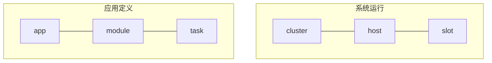

# 2. 应用定义技术规范

Scalebox应用是运行在Scalebox平台上的应用程序。典型的Scalebox应用程序包括高通量数据处理、大规模数据传输等。

## 2.1 术语定义

Scalebox的主要术语类型分为：应用定义（app/module/task）、系统运行（cluster/host/slot）两类。如下图所示：


- 应用定义
  - app：应用（流水线应用），包括多个module；
  - module：模块，应用中算法的容器化封装；
  - task：对应module中每个消息的处理；
- 系统运行
  - cluster：集群，一个或多个头节点+若干个计算节点组成
  - host：节点
  - slot：计算插槽，对应module在host上的运行

## 2.2 标识符命名规则
### 2.2.1	文件名命名规则
文件名字符：数字、英文字母大小写、下划线、点。
### 2.2.2	URI命名规则
App、Module等资源通过URI（Uniform Resource Identifier，统一资源标识符）作唯一标识。常见的URI主要包括URL（Uniform Resource Locator，统一资源定位符）、URN（Uniform Resource Name，统一资源名称）两大类。URI 指的是一个资源，URL 指的是用地址定位一个资源，URN 指的是用名称定位一个资源。 即URL 和 URN 是 URI 的子集。
App、Module等通过URN来定义。

### 2.2.3	版本号命名规则
App、Module等资源类型可以通过版本表示，版本定义遵循语义化版本.
版本格式如下：主版本号.次版本号.修订号，版本号递增规则如下：
·	主版本号：当你做了不兼容的 API 修改，
·	次版本号：当你做了向下兼容的功能性新增，
·	修订号：当你做了向下兼容的问题修正。

先行版本号及版本编译元数据可以加到“主版本号.次版本号.修订号”的后面，作为延伸。


## 2.3 应用定义规范
应用定义文件是用于定义Scalebox应用程序（App）及其模块（Module）的yaml文本文件，还支持集群（Cluster）。

应用定义文件的格式示例如下：

```yaml
name: perf-test.my-app
label: perf-test
version: 1.0.0
cluster: ${CLUSTER}
parameters:
  initial_status: RUNNING
  main_router: main-router
  is_cluster_admin: yes
  default_sleep_count: 20
  comment: This is a sample app.

modules:
  module-1:
    ...
  module-2:
    ...

clusters:
  cluster-1:
    ...
  cluster-2:
    ...


```

应用定义文件分为主配置属性、module定义、cluster定义等部分。

若应用定义文件仅用于cluster的定义，则主配置下的所有属性不生效。

应用定义文件的缺省名为当前目录下的app.yaml。

关于主配置下的字段说明如下：
- *name*: 应用名称，通常用点分的标识符构成
- *label*: 在系统中显示的应用名，通常可以用中文标识。
- *version*: 应用版本号
- *cluster*: 应用中所有module的的缺省集群名
- *comment*: 注释信息
- *parameters*: 应用的参数列表
  - *initial_status*：应用的初始状态，取值为：'RUNNING'/'INITIAL'。若设为‘RUNNING’，则App创建后，直接进入运行状态；
  - *main_router*：指定应用中模块的缺省路由。若模块的后续模块（sink-module）为空，则为该模块指定main-router指定为后续模块；
  - *default_sleep_count*: 所有module的缺省max_sleep_count参数，缺省值为100（6秒为1个单位，计10分钟）

关于module、cluster的详细定义，见后续章节。

## 2.4 模块（Module）定义

```yaml
  my-module:
    label: My First Module
    base_image: scalebox/agent
    cluster: my-cluster
    command: docker run -d --network=host {{ENVS}} {{VOLUMES}} {{IMAGE}}
    arguments:
      ...
    parameters:
      ...
    environmens:
      ...
    paths:
      ...
    slots:
      ...
    sink_modules:
      ...
    sink_vmodules:
      ...
    comment: This is new algorithm module.

```

关于Module的字段说明如下：
- *label*: 应用界面中显示的Module
- *base_image*: 容器镜像名
- *cluster*: 集群名
- *command*: 容器运行的命令模板
- *arguments*: 容器端的标准变量，通常映射为环境变量
        ...
- *parameters*: 模块的服务端参数
        ...
- *environmens*: 环境变量
        ...
- *paths*: 物理路径，通过volume映射
        ...
- *slots*: 模块的slot定义
        ...
```yaml
  slots:
    - ${nodes}[:n]
    - ${nodes}:${n}:${group_prefix}
```
第二行，用于host-bound场景下全局/分组slot定义。
- nodes为slot所在节点
- n为slot数量
- 分组前缀的正则表达式
分组slot的parameters中，设定group_prefix为组前缀

- *sink_modules*: 标识Module间的物理关联，在跨集群应用中，用于标识跨集群的Module间的关联；
        ...
- *sink_vmodules*（串数组）: 用于Module间的逻辑关系。


## 2.5 集群（Cluster）定义

cluster定义的示例如下：

```yaml
  mycluster:
    label: My new clster
    parameters:
      uname: myuser
      port: 10022
      base_data_dir: /global-fs/scalebox/mydata
      local_ip_index: 2
      num_of_executors: Inline cluster only
      channel_size: channel size fo executor, Inline cluster only
      grpc_server: 192.168.3.123:50051
    total_resources:
      num_cores: cpu cores
      total_mem_gb:
      total_disk_tb:
    status: ON
    comment:

```

- *label*:
- *parameters*:
  - *port*: 主机的缺省端口号
  - *uname*: 主机的缺省用户名
  - *base_data_dir*: 集群的数据目录
  - *local_ip_index*: 用于提取本机IP地址的索引号（hostname -I）
  - *grpc_server*:	?有一个相同名称的外部字段。
  - *grpc_remote_server*:

## 2.6 应用定义文件中的模板参数

除虚拟模板参数CLUSTER_DATA_DIR之外，模板变量必须先定义，再使用。以下是模板变量定义及优先排序（从低到高）
- ```/etc/scalebox/environments```
- ```${HOME}/.scalebox/environments```
- ```${PWD}/scalebox.env```
- ```${PWD}/${{env-defined}}.env```
- ```${PWD}/${{env-defined}}_${{app-defined}}.env```
- 当前命令行中，已定义的环境变量

虚拟模板变量CLUSTER_DATA_DIR表示module所在集群的base_data_dir，无需定义即可使用。


## 2.7 附表

### 2.7.1 app-parameters参数表
| 参数名称            |   含义                         |
| ------------------ | ----------------------------- |
| initial_status     | 'RUNNING'/'PAUSED'            |
| messsage_router    |                               |
| default_idle_polls | 所属module的缺省的空闲轮询次数    |
| is_cluster_admin   |                               |
| slot_group         | map形式的多节点的多module-slot配置，用于新增节点的slot自动创建。例：'{"module0":n0,"module1",n1}' |

### 2.7.2 module-arguments参数表

| 参数名                  | 标准环境变量             | 含义                                                                    |
| ---------------------- | ---------------------- | ---------------------------------------------------------------------- |
| grpc_server           | GRPC_SERVER            | controld的服务端点（endpoint），```${ip_addr}:${port}```，port缺省值为50051 |
| code_path             |                        | 模块的代码目录，通过容器的数据卷Volume映射到容器内/app/bin                    |
| local_ip_index        | LOCAL_IP_INDEX         | hostname -I'返回IP地址列表，该参数指定列表中的第n个IP地址作为本机IP地址。       |
|                       | CLUSTER                | 所在的集群名                                                       |
|                       | MODULE_NAME               | 当前module名称                                                       |
|                       | MODULE_ID                 | module-id                                                         |
|                       | FROM_MODULE               | module-name                                                       |
|                       | FROM_IP                | from-ip                                                       |
|                       | SINK_MODULE               | 缺省sink_module的名称                                             |
|                       | IS_SINGULARITY         | 容器引擎为singularity或apptainer      |
| task_max_seconds      | TASK_MAX_SECONDS       | 每个task运行中超时设置的秒数，若运行时间超过该时限，task运行中断，返回超时码124 |
| task_min_seconds      | TASK_MIN_SECONDS       | 每个task运行的最小秒数，若运行时间连续多次低于此值，则判定slot为GREEDY异常，并退出 |
| poll_interval_seconds | POLL_INTERVAL_SECONDS | Slot 检查新任务的轮询间隔。slot睡眠并定期检查task可用，该参数指定以秒计的时间间隔，缺省值为6秒。 |
| max_idle_polls        | MAX_IDLE_POLLS        | Slot 在退出前可进行的最大空闲轮询次数。slot退出前的最多睡眠次数。缺省值为100（10分钟）                              |
| dir_quota_gb          | DIR_QUOTA_GB          | 标准流控参数，目录本身的容量配额限制。用于指定目录以GB计的最大空间。格式为： ```'{"/dir-1":10,"/dir-2":100}'```  |
| free_space_gb         | FREE_SPACE_GB         | 标准流控参数，目录所在磁盘需要保留的最小空间。用于指定目录所在分区以GB计的最小保留空间。格式为```'{"/dir-3":10,"/dir-4":100}'``` |
| task_batch_size       | TASK_BATCH_SIZE | 批量获取任务的数量。设置slot单批次读取的最大消息数，缺省值为1。针对运行时长在5秒以内的任务，可设置批量读取消息，避免读取频繁而导致server端过载、数据不一致。 |
| batch_atomic          | BATCH_ATOMIC           | 'no'/'yes'。用单个run脚本，处理全批次的任务。 |
| heartbeat_seconds     | HEARTBEAT_SECONDS      | 以秒计的心跳间隔，缺省值为60；若为非正整数，则禁用心跳操作 |
| output_text_size      | OUTPUT_TEXT_SIZE       | task运行记录t_task_exec中，大文本字段（stdout/stderr/custom_out）的最大字节数。缺省值为65535，最大值可以为10MB(for varchar) 或1GB(for text) |
| text_trunc_mode       | TEXT_TRUNC_MODE        | HEAD'/'TAIL', default value is 'HEAD'，头截断，保留末尾部分          |
| timezone_mode         |                        | HOST'/'UTC'/'NONE'                                                |
| max_slot_workdir_gb   |                        |        未使用                       |
| slot_options          |                        | 逗号分隔的slot选项                                                  |
|  - always_running     | ALWAYS_RUNNING         | 设定slot一直运行，不主动退出（一般仅用于调试）    |
|  - reserved_on_exit   |                        | slot退出后，保留容器，以便排错。(docker-only，命令行去掉--rm)    |
|  - tmpfs_workdir      |                        | 用tmpfs文件系统存放工作目录/work（针对docker，解析后的命令行加上--tmpfs /work；针对singularity，解析后增加环境变量TMPFS_WORKDIR=yes）|
|  - disable_local_mapping |                        | 不生成将本地物理目录到容器内/local_data_root的映射  |
|  - disable_data_mapping  |                        | 不生成将集群数据目录到容器内/cluster_data_root的映射 |
|  - wrap_debug            | WRAP_DEBUG             | 调试选项，输出消息处理前后agent端的前后处理详细信息，用于流水线调试，生产环境可关闭此选项(待删除)  |
|  - enable_trace          | ENABLE_TRACE           | 调试程序选项，输出消息处理前后agent端的前后处理详细信息，用于流水线调试，生产环境可关闭此选项          |
|  - async_task_creation   | ASYNC_TASK_CREATION    |   （拟删除）                      |
|  - slot_on_head          |                        |                                  |

### 2.7.3 module-parameters参数表

| 参数名                  | 说明                                                                        |
| -------------------- | ---------------------------------------------------------------------------- |
| priority             | 优先级(暂未使用)                                            |
| key_group_regex      | 从消息中提取分组的正则表达式  （改名为group_regex?）            |
| key_group_index      | 分组排序的编号               (改名为group_index?)            |
| task_dist_mode       | task分发模式，'HOST-BOUND'/'SLOT-BOUND'/'DEFAULT'   |
| start_task        | 给定初始消息，若为'FILE:{filename}'，则将文件中每一行作为一个初始消息  |
| initial_task_status  | task的初始状态，'READY'/'INITIAL'                               |
| initial_slot_status  | slot的初始状态，'READY'/'OFF'                                   |
| retry_rules          | 基于退出码的重试规则<br>```"['exit_code_1:num_retries',...,'exit_code_n:num_retries']"```。num_retries缺省值为1，退出码通配符为'*'。拟修改格式为```{"exit_code_1":num_retries',...,"exit_code_n":num_retries}``` |
| slot_recoverable     | 'yes'，支持将出错后已退出的slot从'ERROR'设置为'READY'，以支持slot级重试 (以slot_max_retries替换？,TIMED-OUT/GREEDY分别处理)  |
| slot_max_retries     | slot状态从'TIMED-OUT'设置为'READY'的重试次数(?)          |
| slot_timeout_minutes | 若slot未正常启动，则一直处于'STARTING'状态。设置以分钟计的timeout，到期后将状态转换为'TIMEOUT'。缺省值为15分钟。对于不允许重复启动的slot实例（用GPU等），可设置较大值。 |
| task_global_timeout_scale | 若外部原因（slot异常退出等）导致task一直处于运行状态（状态码-3）。通过全局超时设置，恢复task状态码为123。该值为相对task_max_seconds的倍数，缺省值为2.0。全局退出设定返回码123。 拟改为task_timeout_scale_factor ？|
| main_router_index | 多消息路由的应用环境中，指定当前module发给第n个消息路由。缺省值为0，通常设置值>0，以指定特定main-router实例  |
| pod_id               | 标识本module属于pod管理，若消息来源的pod也有相同的pod_id，则所有task标识为采用本地计算（task_dist_mode为HOST_BOUND）  |
| task_dedup_cache_ttl_minutes | 任务去重缓存的生存时间，在高负载时需设置。设定重复task-id检测的cache过期时间（分钟数），缺省值为30分钟，清除时间为n+1分钟。避免出现同一task的多次分发。通常情况下，其时间需大于```task_max_seconds```的值。 |
| visible              | 在流水线逻辑图中是否可见。缺省值为'yes'                                          |
| task_id_in_headers   | 返回的headers中，包含task_id值。|
| app_id_in_headers    | 返回的headers中，包含app_id值。 |
| node_progress_gap    | 标准流控参数，针对指定module同一组内node间运行同步，最快node与最慢node间的运行的task最大差值，其值为整数。在对应slot生成时，自动创建对应信号量，其名称为```node_progress:${mod_name}:${hostname}```，初值为0。该参数格式示例为```{"prefix1":4,"node_prefix2":6}```。该参数拟替换为node_progress_max_gap？ |
| vtask_role   | 'head' / 'core' / 'tail'，vtask处理中当前的角色，仅针对非路由模块有效。head是vtask处理的起始模块；tail是结束模块；core是算法模块。|
| vtask_size   | 标准流控参数，定义可同时处于就绪/运行状态的vtask 数量上限，在app解析时，创建对应信号量及初值。<br/>用于全局vtask流控的信号量名为：```vtask_size:${mod_name}```；<br/>用于SLOT-BOUND的vtask流控信号量名为：```slot_vtask_size:${mod_name}:${slot_id}:${slot_seq}```；<br/>用于HOST-BOUND的vtask流控信号量名为：```host_vtask_size:${mod_name}:${hostname}```|
| vtask_size_sema_copy | 'no' / 'yes'。为vtask_size信号量生成一个拷贝，用于编程控制。拷贝信号量名称为原始信号量前加冒号```:```，初值与原始信号量相同。|


### 2.7.4 cluster-parameters参数表
| 参数名称         |   含义                         |
| --------------- | ----------------------------- |
| base_data_dir   |  可通过两种方式引用：虚拟环境变量CLUSTER_DATA_ROOT，容器内/data目录   |
| code_dir        |                               |
| uname           | ssh登录用户名                   |
| port            | ssh登录用户名                   |
| pg_host         | postgres的连接信息，${pg_ip}[:${pg_port}] |

### 2.7.5 host-parameters参数表

| 参数名称         |   含义                         |
| --------------- | ----------------------------- |
| uname           | ssh登录用户名                   |
| port            | ssh的端口号                     |
| node_slot       | 该节点node-agent的slot号        |
| group_id        | 该节点所属节点组的编号            |
| slurm_node      | 在slurm调度系统中对应的节点编号    |
| reg_time        | 在scalebox中注册时间             |
| slot_module_id     | 在slurm调度系统重，node-agent的slurm module id |
| default_runtime | 缺省容器引擎,'docker'/'singularity' |
| use_home_tmp    | 针对不允许/tmp下运行程序的节点(I/O节点)，以$HOME/tmp代替 /tmp作为远程启动slot的临时目录。|
| ssh_cepher      | 'aes128-gcm@openssh.com' / 'aes256-gcm@openssh.com' / 'chacha20-poly1305@openssh.com' |

- 单线程性能对比

| 算法	            | 参数值                        |硬件AES-NI(x64)| 软件实现(无AES-NI)| 说明                |
| ---------------- | ---------------------------- | ------------- | ----------------| -------------------|
| AES-128-GCM      | aes128-gcm@openssh.com       | 5~7 GB/s      |	150~200 MB/s    | 最优选择，硬件加速极快 |
| AES-256-GCM	     | aes256-gcm@openssh.com       | 3~5 GB/s	    | 120~150 MB/s    | 稍慢但安全性更高      |
| ChaCha20-Poly1305| chacha20-poly1305@openssh.com| 1~2 GB/s      | 600~700 MB/s    | 软件效率高，尤其在无AES-NI时比AES快 |

### 2.7.6 slot-parameters参数表

| 参数名称      | 含义                                     |
| ------------ | --------------------------------------- |
| reg_time     | 注册时间                                 |
| last_access  | 最后访问时间                              |
| group_prefix | slot的分组前缀，在HOST-BOUND模块中的分组slot |
