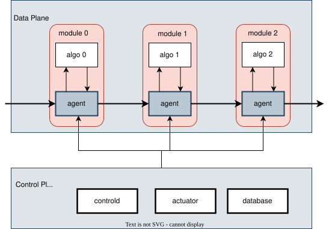
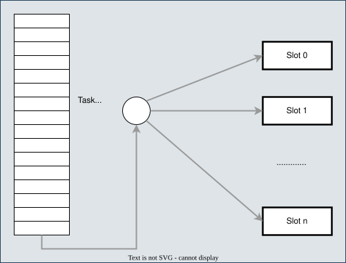
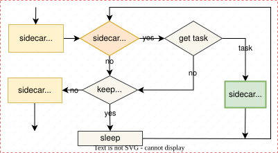

# 1. Scalebox编程模型


## 1.1 系统架构


### 1.1.1 系统架构图


图1 scalebox系统架构

### 1.1.2 分层架构

Scalebox采用分层架构设计，分为三个主要层次：

1. **算法模块层**
   - 支持多种程序语言实现（Python、Go、C++、Java等）
   - 每个模块是独立的算法组件或功能单元
   - 采用容器化封装，实现环境隔离和部署灵活性

2. **模块连接层**
   - 基于shell编程实现模块间连接
   - 算法执行结果通过标准输出反馈到系统
   - 传递信息包括：后续消息路径、执行时间、I/O数据量、执行结果

3. **并行程序全局层**
   - 使用YAML配置文件定义模块间关联
   - 实现跨节点的分布式计算流程控制
   - 支持流水线并行和数据并行模式

### 1.1.3 核心组件

Scalebox的核心组件包括：

- **controld**：基于gRPC的控制服务，管理actuator和计算节点
- **actuator**：启动器服务，通过SSH或外部调度器在计算节点上启动slot
- **database**：PostgreSQL数据库，存储app、module、task、slot等元数据
- **webui**：用户操作 Scalebox的web接口
- **agent**：运行在计算节点上的代理，负责任务执行和状态管理
- **cluster-admin**：与HPC调度系统交互的资源申请、管理的软件模块，也是一个系统级应用

### 1.1.4 架构特性

- **天然分布式设计**：模块间松耦合，天然支持分布式部署
- **事件驱动执行**：基于消息传递的通信机制
- **云原生设计**：容器化封装，支持跨平台部署
- **跨集群支持**：支持跨广域网异构算力集群的统一调度
- **级联支持**：模块层级上agent之间通过级联，支持流水线并行

## 1.2 编程模型

### 1.2.1 两级编程模型

Scalebox采用两级编程模型，将复杂计算逻辑分层：

1. **算法逻辑层**
   - 关注单节点算法实现
   - 无需刻意关注多节点并行
   - 以容器化封装，提供标准接口

2. **并行逻辑层**
   - 处理算法并行执行相关的业务逻辑
   - 包括资源调度、数据分布、任务分配
   - 支持全局状态管理、通信原语、流控处理

### 1.2.2 事件驱动架构

Scalebox采用事件驱动的编程模型：

```
事件触发 → 任务分发 → 模块执行 → 结果反馈 → 后续任务触发
```

每个模块相当于操作原语，通过事件驱动机制实现复杂的分布式计算逻辑。系统通过任务队列和调度器，将输入数据分发到相应的模块进行处理，处理结果再触发后续模块的执行，形成完整的数据处理流水线。

### 1.1.2 并行程序结构


图2 传统并行程序 vs 容器化并行程序


图3 可编程容器化程序


## 1.3 核心概念

App、Module、Task、Slot、Host、Cluster 等核心概念的详细定义，见 :doc:`使用指南 - 核心概念 <../user/2_core_concepts>`。

## 1.4 设计原理

### 1.4.1 可编程容器化

从传统容器化到可编程容器化的演进：

- **传统容器化**：仅封装应用和依赖，提供统一的资源层接口
- **可编程容器化**：在算法容器之上定义统一的北向接口规范，接受外部消息驱动

### 1.4.2 沙漏模型

Scalebox采用沙漏模型设计，将标准化协议或接口集中于"窄腰"部分，平衡系统的灵活性和复杂度：

- 上层：复杂的应用层协议
- 中间：标准化的容器接口
- 下层：灵活的底层实现

沙漏模型是在网络通信、分布式系统的架构设计中常用模型，其设计出发点是为实现灵活性、互操作性和标准化，这一设计理念源于对系统分层结构的需求，将核心协议或接口作为中间“窄腰”部分，既能保证上下层的独立性，又能实现跨层的统一协调。

各类容器技术都遵循OCI(Open Container Initiative)模型，使得设计独立于应用类型、分布式系统的通信协议/数据表示成为可能。但当前容器技术仅作为一种应用封装技术，并不能解决分布式软件的核心协议和接口。


图1 分布式计算沙漏模型（可编程容器化）

按以上沙漏模型设计可编程容器化计算模型，可利用沙漏模型的优势。并且容器技术部署上的优势，就极大提升对分布式软件研发的支持。

### 1.4.3 无状态设计

模块采用无状态设计原则：

- 任务运行的无状态，可重复运行
- 支持任务级幂等性
- 通过环境变量、任务头定义不同逻辑处理

## 1.5 模块架构



- 控制平面管理任务队列，采用事件驱动编程模型
- 系统的核心是事件驱动的任务分发和执行机制
- 数据平面的slot通过队列获取任务，实现分布式并行计算
- 灵活高效

## 1.6 执行槽（Slot）架构



### 1.6.1 Sidecar模式

每个算法模块以sidecar方式运行，与系统核心服务解耦：
- 通过标准输入输出与系统交互
- 支持热插拔和动态替换

### 1.6.2 Slot管理

Slot是节点上与Module对应的计算资源切片，是Task细粒度运行调度的基础单位：
- 每个slot负责执行特定的任务类型
- 支持动态扩缩容
- 支持故障恢复和任务重试

## 1.7 并行化策略

### 1.7.1 模块内并行
算法内部的代码级并行，如多线程、GPU加速等。

### 1.7.2 模块级并行
同一模块的多个实例并行处理不同数据，实现数据并行。

### 1.7.3 模块间并行
不同模块通过流水线方式并行执行，实现流水线并行。

### 1.7.4 混合并行
结合以上多种并行方式，实现最优的并行效率。

## 1.8 运行时环境

### 1.8.1 控制平面
- controld：核心控制服务
- actuator：slot启动和管理
- database：元数据存储

### 1.8.2 数据平面
- agent：任务执行代理
- slot：计算资源单元
- 消息总线：模块间通信

### 1.8.3 通信机制
- gRPC：控制平面通信
- 消息队列：数据平面通信
- 数据库：状态持久化
