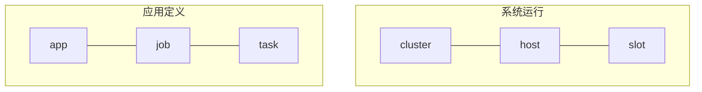

# 2. Scalebox应用技术规范

Scalebox应用是：.....

## 2.1 术语定义

Scalebox的主要术语类型分为：应用定义（app/job/task）、系统运行（cluster/host/slot）两类。如下图所示：


- 应用定义
  - app：应用（流水线应用），包括多个job；
  - job：模块，应用中算法的容器化封装；
  - task：对应job中每个消息的处理；
- 系统运行
  - cluster：集群，一个或多个头节点+若干个计算节点组成
  - host：节点
  - slot：计算插槽，对应job在host上的运行

## 2.2 标识符命名规则
### 2.2.1	文件名命名规则
文件名字符：数字、英文字母大小写、下划线、点。
### 2.2.2	URI命名规则
App、Job等资源通过URI（Uniform Resource Identifier，统一资源标识符）作唯一标识。常见的URI主要包括URL（Uniform Resource Locator，统一资源定位符）、URN（Uniform Resource Name，统一资源名称）两大类。URI 指的是一个资源，URL 指的是用地址定位一个资源，URN 指的是用名称定位一个资源。 即URL 和 URN 是 URI 的子集。
App、Job等通过URN来定义。

### 2.2.3	版本号命名规则
App、Job等资源类型可以通过版本表示，版本定义遵循语义化版本.
版本格式如下：主版本号.次版本号.修订号，版本号递增规则如下：
·	主版本号：当你做了不兼容的 API 修改，
·	次版本号：当你做了向下兼容的功能性新增，
·	修订号：当你做了向下兼容的问题修正。

先行版本号及版本编译元数据可以加到“主版本号.次版本号.修订号”的后面，作为延伸。

## 2.3 模块的构建规范

为解耦模块算法，以非侵入式调用，主算法及相关辅助程序作为独立应用程序，封装在容器镜像中。
- 模块定义规范：通过Dockerfile定义容器化规范，以此为基础构建容器镜像。


### 2.3.4 Dockerfile示例

```Dockerfile
FROM my-image


```

## 2.4 应用定义规范
应用定义文件是用于定义Scalebox应用程序（App）及其模块（Job）的yaml文本文件，还支持集群（Cluster）和数据集（DataSet）的定义。

应用定义文件的格式示例如下：

```yaml
name: perf-test.my-app
label: perf-test
version: 1.0.0
cluster: ${CLUSTER}
parameters:
  initial_status: RUNNING
  message_router: message-router
  is_cluster_admin: yes
  default_sleep_count: 20
  comment: This is a sample app.

jobs:
  job-1:
    ...
  job-2:
    ...

clusters:
  cluster-1:
    ...
  cluster-2:
    ...

datasets:
  dataset-1:
    ...
  dataset-2:
    ...

```

应用定义文件分为主配置属性、job定义、cluster定义、dataset定义等部分。

若应用定义文件仅用于cluster、dataset的定义，则主配置下的所有属性不生效。

应用定义文件的缺省名为当前目录下的app.yaml。

关于主配置下的字段说明如下：
- *name*: 应用名称，通常用点分的标识符构成
- *label*: 在系统中显示的应用名，通常可以用中文标识。
- *version*: 应用版本号
- *cluster*: 应用中所有job的的缺省集群名
- *comment*: 注释信息
- *parameters*: 应用的参数列表
  - *initial_status*：应用的初始状态，取值为：'RUNNING'/'INITIAL'。若设为‘RUNNING’，则App创建后，直接进入运行状态；
  - *message_router*：指定应用中模块的缺省路由。若模块的后续模块（sink-job）为空，则为该模块指定message-router指定为后续模块；
  - *default_sleep_count*: 所有job的缺省max_sleep_count参数，缺省值为100（6秒为1个单位，计10分钟）

关于job、cluster、dataset的详细定义，见后续章节。

## 2.1 模块（Job）定义

```yaml
  my-job:
    label: My First Job
    base_image: scalebox/agent
    cluster: my-cluster
    command: docker run -d --network=host {{ENVS}} {{VOLUMES}} {{IMAGE}}
    variables:
      ...
    parameters:
      ...
    environmens:
      ...
    input_datasets:
      ...
    output_datasets:
      ...
    paths:
      ...
    hosts:
      ...
    resource_claim:
      ...
    sink_jobs:
      ...
    sink_vjobs:
      ...
    comment: This is new algorithm module.

```


关于Job的字段说明如下：
- *label*: 应用界面中显示的Job
- *base_image*: 容器镜像名
- *cluster*: 集群名
- *command*: 容器运行的命令模板
- *variables*: 容器端的标准变量，通常映射为环境变量
        ...
- *parameters*: 模块的服务端参数
        ...
- *environmens*: 环境变量
        ...
- *input_datasets*: 输入数据集，通过volume映射
        ...
- *output_datasets*: 输出数据集，通过volume映射
        ...
- *paths*: 物理路径，通过volume映射
        ...
- *hosts*: 模块的slot定义
        ...
- *resource_claim*: 模块的资源需求，用于动态调度
        ...
- *sink_jobs*: 标识Job间的物理关联，在跨集群应用中，用于标识跨集群的Job间的关联；
        ...
- *sink_vjobs*（串数组）: 用于Job间的逻辑关系。


## 2.5 集群（Cluster）定义

cluster定义的示例如下：

```yaml
  mycluster:
    label: My new clster
    parameters:
      uname: myuser
      port: 10022
      base_data_dir: /global-fs/scalebox/mydata
      local_ip_index: 2
      num_of_executors: Inline cluster only
      channel_size: channel size fo executor, Inline cluster only
      grpc_server: 192.168.3.123:50051
      host_alloc_config:
    total_resources:
      num_cores: cpu cores
      total_mem_gb:
      total_disk_tb:
    status: ON
    comment:

```

- *label*:
- *parameters*:
  - *port*: 主机的缺省端口号
  - *uname*: 主机的缺省用户名
  - *base_data_dir*: 集群的数据目录
  - *local_ip_index*: 用于提取本机IP地址的索引号（hostname -I）
  - *relay_endpoint*:
  - *storage_endpoint*: 
  - *grpc_server*:	?有一个相同名称的外部字段。
  - *grpc_remote_server*:
  - *host_alloc_config*:	动态集群的配置，示例：{"g00": 1, "g01": 1, "other": 2}


## 2.5 数据集（Dataset）定义

数据集定义

## 2.6 应用定义文件中的模板参数

除虚拟模板参数CLUSTER_DATA_DIR之外，模板变量必须先定义，再使用。以下是模板变量定义及优先排序（从低到高）
- /etc/scalebox/environments
- ${HOME}/.scalebox/environments
- ${PWD}/scalebox.env
- ${PWD}/env-defined.env
- ${PWD}/env-defined_app-defined.env
- 当前命令行中，已定义的环境变量

虚拟模板变量CLUSTER_DATA_DIR表示job所在集群的base_data_dir，无需定义即可使用。


## 2.7 附表

### 2.7.1 app-parameters参数表
| 参数名称           |   含义                        |
| ---------------  | ----------------------------- |
| initial_status   | 'RUNNING'/'PAUSED'            |
| messsage_router  |                               |
| is_cluster_admin |                               |

### 2.7.2 job-variables参数表

| 参数名                    | 标准环境变量             | 含义                                                                        |
| ------------------------ | ---------------------- | -------------------------------------------------------------------------- |
| grpc_server              | GRPC_SERVER            | 服务端controld的服务端点（endpoint），${ip_addr}:${port}，port缺省值为50051     |
| code_path                |                        | 模块的代码目录，通过容器的数据卷Volume映射到容器内/app/bin                         |
| local_ip_index           | LOCAL_IP_INDEX         | hostname -I'返回IP地址列表，该参数指定列表中的第n个IP地址作为本机IP地址。            |
| task_timeout_seconds     | TASK_TIMEOUT_SECONDS   | 每个task运行中超时设置的秒数，若运行时间超过该时限，task运行中断，返回超时码124        |
| sleep_interval_seconds   | SLEEP_INTERVAL_SECONDS | slot睡眠并定期检查task可用，该参数指定以秒计的时间间隔，缺省值为6秒                  |
| max_sleep_count          | MAX_SLEEP_COUNT        | slot退出前的最多睡眠次数。缺省值为100（10分钟）                                   |
| dir_limit_gb             | DIR_LIMIT_GB           | 标准流控参数，用于指定目录以GB计的最大空间。格式为：/data-dir~n，n为GB数             |
| dir_free_gb              | DIR_FREE_GB            | 标准流控参数，用于指定目录所在分区以GB计的最小保留空间。格式为：/data-dir~n，n为GB数   |
| progress_counter_diff    | PROGRESS_COUNTER_DIFF  | 标准流控参数，用于多个并行执行的host间的运行同步，指定与最慢host间的差值。其值为整数。需在message-router初始化时，创建对应的信号量及初值，信号量名称为：progress_counter_{模块名}:{节点名}，初值为该job在每个节点上task总数。   |
| output_text_size         | OUTPUT_TEXT_SIZE       | task运行记录t_task_exec中，大文本字段（stdout/stderr/custom_out）的最大字节数。缺省值为65535，最大值可以为10MB(for varchar) 或1GB(for text) |
| text_tranc_mode          | TEXT_TRANC_MODE        | HEAD'/'TAIL', default value is 'HEAD'，头截断，保留末尾部分                    |
| heart_beat_seconds       |                        | 以秒计的心跳间隔                                                              |
| timezone_mode            |                        | HOST'/'UTC'/'NONE'                                                         |
| max_slot_workdir_gb      |                        |                                                                            |
| slot_options             |                        | 逗号分隔的slot选项                                                           |
|  - with_headers          | WITH_HEADERS           | 启动task运行命令中，增加task头信息头                                           |
|  - always_running        | ALWAYS_RUNNING         | 设定slot一直运行，不主动退出（一般仅用于调试）                                   |
|  - reserved_on_exit      |                        | slot退出后，保留容器，以便排错。(docker-only，命令行去掉--rm)                    |
|  - tmpfs_workdir         |                        | 用tmpfs文件系统存放工作目录/work（针对docker，解析后的命令行加上--tmpfs /work；针对singularity，解析后增加环境变量TMPFS_WORKDIR=yes）    |
|  - disable_local_mapping |                        | 不生成将本地物理目录到容器内/local的映射                                        |
|  - disable_data_mapping  |                        | 不生成将集群数据目录到容器内/data的映射                                         |
|  - enable_trace          | TRACE                  |  调试程序选项，输出详细信息                                                   |
|  - hide_local_ip         | SOURCE_IP_ATTACHED     | (source_ip_attached)                                                       |
|  - async_task_creation   | ASYNC_TASK_CREATION    |                                                                            |
|  - slot_on_head          |                        |                                                                            |
|                          | CLUSTER                | 所在的集群名                                                                 |
|                          | JOB_NAME               | 当前job名成                                                                 |
|                          | JOB_ID                 | job_id                                                                     |
|                          | SLOT_ID                | slot_id                                                                    |
|                          | SINK_JOB               | 缺省sink_job的名称                                                           |
|                          | IS_SINGULARITY         | 容器引擎为singularity或apptainer                                             |

### 2.7.3 job-parameters参数表

| 参数名                  | 含义                                                                        |
| -------------------- | ----------------------------------------------------------------------------- |
| priority             | 优先级(暂未使用)                                                                 |
| key_group_regex      | 从消息中提取分组的正则表达式                                                       |
| key_group_index      | 分组排序的编号                                                                   |
| task_dist_mode       | task分发模式，'HOST-BOUND'/'SLOT-BOUND'/'GROUP-BOUND'                           |
| task_queue_length    | task_queue的长度。若设置该值，则启用task_queue作为task分发方式                       |
| tasks_per_queue      | in-mem模式中，task队列长度。缺省值为100(待删除)                                   |
| slot_on_head         | 仅在头节点上生成1个slot，'yes'/'no'       (放到variables中？)                      |
| start_message        | 给定初始消息，若为'FILE:{filename}'，则将文件中每一行作为一个初始消息                     |
| initial_task_status  | task的初始状态，'READY'/'INITIAL'                                             |
| initial_slot_status  | slot的初始状态，'READY'/'OFF'                                                 |
| retry_rules          | 基于退出码的重试规则<br>```['exit_code_1:num_retries',...,'exit_code_n:num_retries']``` |
| enable_default_retrries | 设置常见的retry_rules，包括timeout(124)、...等                                 |
| slot_timeout_seconds | 以秒计的slot超时设置。缺省值为30秒                                                 |
| visiable             | 在流水线逻辑图中是否可见。缺省值为'yes'                                             |
| max_tasks_per_minute | 设置slot每分钟可运行的task数量，超过该值，说明该slot异常，则设置为出错。                |
| message_router_index | 多消息路由的应用环境中，指定当前job发给第n个消息路由。缺省值为0，通常设置值>0，以指定特定message-router  |
| pod_id               | 标识本job属于pod管理，若消息来源的pod也有相同的pod_id，则所有task标识为采用本地计算     |
| bulk_message_size    | 针对运行时间小于10秒的任务，可设置批量读取消息，避免读取频繁而导致server端过载、数据不一致。设置slot批处理消息的最大数量，缺省值为1。        |
| task_cache_expired_minutes | 设定重复task-id检测的cache过期时间（分钟数），缺省值为30分钟，清除时间为n+1分钟。避免出现同一task的多次分发。   |


### 2.7.4 cluster-parameters参数表
| 参数名称         |   含义                         |
| --------------- | ----------------------------- |
| base_data_dir   |  可通过两种方式引用：虚拟环境变量CLUSTER_DATA_ROOT，容器内/data目录   |
| code_dir        |                               |
| uname           | ssh登录用户名                   |
| port            | ssh登录用户名                   |

### 2.7.5 host-parameters参数表

| 参数名称         |   含义                         |
| --------------- | ----------------------------- |
| uname           | ssh登录用户名                   |
| port            | ssh的端口号                     |
| node_slot       | 该节点node-agent的slot号        |
| group_id        | 该节点所属节点组的编号            |
| slurm_node      | 在slurm调度系统中对应的节点编号    |
| reg_time        | 在scalebox中注册时间            |
| slot_job_id     | 在slurm调度系统重，node-agent的slurm job id |

### 2.7.6 slot-parameters参数表

| 参数名称         | 含义                           |
| --------------- | ----------------------------- |
| reg_time        | 注册时间                       |
| last_access     | 最后访问时间                    |
