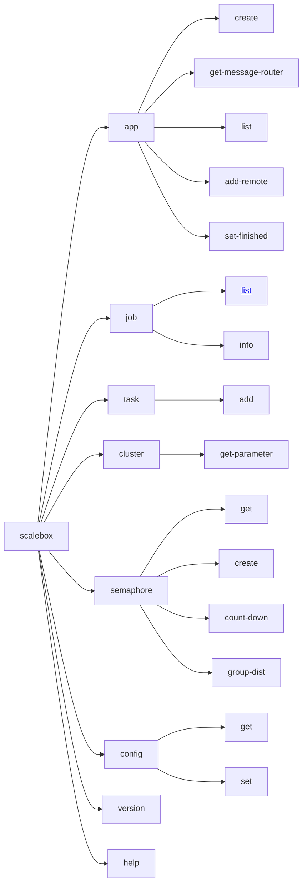

# 1. 命令行工具

命令行工具scalebox

## 1.1 命令行选项

| 选项   | 缺省值 | 描述   |
| ----------------- | -------------- | --------------------------------- |
| -e / --env-file   | scalebox.env   | 环境变量文件，设置命令运行的环境变量。 |
| --debug           | 'no'           | 设置调试标志位，输出更多调试、排错的信息 |

## 1.2 子命令

## 1.3 scalebox app 子命令

### app create

### app add-remote

### app set-finished

### app get-message-router
  

## 1.4 scalebox task 子命令

### task add

## 1.5 scalebox semaphore 子命令

### semaphore create

### semaphore count-down

### semaphore get

### semaphore group-dist

