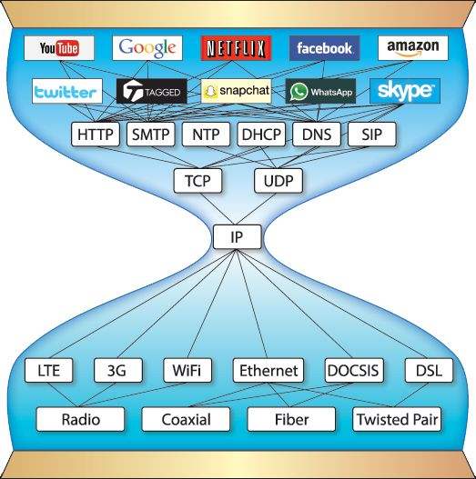

# 3. 可编程容器化

## 3.1 基本原理

### 3.1.1 从传统容器化到可编程容器化

- 传统应用：应用程序的依赖包及库文件需安装在计算节点上；
- 容器化应用：将依赖包、库文件与应用程序一起打包到容器中，简化软件部署；统一容器的资源层接口（南向接口）对接底层计算平台。
- 可编程容器化：在容器化应用基础上，定义标准接口，形成标准模块。接受外部消息驱动模块的运行。在算法容器之上定义统一的应用接口（北向接口）规范。

图1 传统容器化 vs 可编程容器化

- 传统容器化：封装通过统一的容器层向下接口对接底层计算资源，并未对上层应用接口做规范化，外部调用的接口为容器内算法代码自身提供的微服务接口，包括gRPC、REST等不同形式；
- 可编程容器化：以容器化为基础，在算法代码服务接口基础上，定义消息驱动式的统一容器级编程接口（北向接口）规范，供上层应用调用，以形成可编程驱动的标准化算法容器。

### 3.1.2 沙漏模型图

沙漏模型是在网络通信、分布式系统的架构设计中常用模型，其设计出发点是为了实现灵活性、互操作性和标准化，这一设计理念源于对系统分层结构的需求，将核心协议或接口作为中间“窄腰”部分，既能保证上下层的独立性，又能实现跨层的统一协调。

图2 TCP/IP网络传输沙漏模型

TCP/IP沙漏模型描述了如何在网络通信中实现跨平台互联互通。沙漏的“窄腰”部分代表了TCP/IP协议栈的核心——IP 层，连接上面的传输层和应用层、下面的链路层和物理层。

通过统一的IP协议实现不同网络的互通，也使得应用层协议和物理层协议彼此独立。这种分层结构允许新的应用层协议在不改变底层网络的情况下开发，同时也可以在不影响应用层的情况下改进底层的物理和链路层技术。

沙漏模型的设计极大地增强了TCP/IP协议栈的灵活性和可扩展性，是现代互联网得以广泛应用的一个关键因素。

针对分布式系统的沙漏模型，网格计算已经在分层模型上开展了相关尝试[1]。

容器技术的出现，并且各类容器技术都遵循OCI(Open Container Initiative)模型，使得设计独立于应用类型、分布式系统的通信协议/数据表示成为可能。但当前容器技术仅作为一种应用封装技术，并不能解决分布式软件的核心协议和接口。

图3 分布式计算沙漏模型（可编程容器化）

按以上沙漏模型设计可编程容器化计算模型，可利用沙漏模型的优势。并且容器技术部署上的优势，就极大提升对分布式软件研发的支持。

沙漏模型通过将标准化协议或接口集中于“窄腰”部分，平衡了系统的灵活性和复杂度，既支持不同层次的独立发展，又确保了整体架构的统一性和高效性，是实现跨平台互联互通和资源优化的重要架构设计方法，是网络通信和分布式系统得以大规模应用的关键。

## 3.2 容器化计算编程模型

- 分层结构
- 天然分布式基础平台
- 全局信号量、全局变量
### 3.2.1 并行程序结构

图4 传统并行程序 vs 容器化并行程序

图5 可编程容器化程序

### 3.2.2 可编程模块

图6 可编程模块结构

图7 消息驱动式模块示意图

消息驱动式接口
- 消息体：无空字符的json格式字符串、不含空字符、逗号的字符串
- 消息头：无空字符的json格式字符串

#### 普通模块

#### 消息路由

## 3.3 应用状态管理

### 应用状态

应用状态是什么？

### 模块的无状态设计

### 应用状态

- 模块内：文件存储
- 全局状态存储：基于共享变量

## 参考文献
