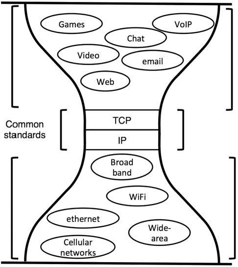

# 3. 可编程容器化

## 3.1 基本原理

### 从传统容器化到可编程容器化

- 传统应用：应用程序的依赖包及库文件需安装在计算节点上；
- 容器化应用：将依赖包、库文件与应用程序一起打包到容器中，简化软件部署；统一容器的资源层接口（南向接口）对接底层计算平台。
- 可编程容器化：在容器化应用基础上，定义标准接口，形成标准模块。接受外部消息驱动模块的运行。在算法容器之上定义统一的应用接口（北向接口）规范。

图1 传统容器化 vs 可编程容器化

传统容器化封装通过统一的容器层向下接口对接底层计算资源，并未对上层应用接口做规范化，外部调用的接口为容器内算法代码自身提供的微服务接口，包括gRPC、REST等不同形式；可编程容器化计算则是以此为基础，在算法代码服务接口基础上，定义消息驱动式的统一容器级编程接口（北向接口）规范，供上层应用调用，以形成可编程驱动的标准化算法容器。

### 沙漏模型图

图2 TCP/IP沙漏模型图

图3 可编程容器化沙漏模型图

### 可编程模块结构

图4 可编程模块结构

消息驱动式接口
- 消息体：无空字符的json格式字符串、不含空字符、逗号的字符串
- 消息头：无空字符的json格式字符串

## 3.2 编程模型

- 分层结构
- 天然分布式基础平台
- 全局信号量、全局变量

图5 传统并行程序

图6 容器化并行程序

图7 可编程容器化程序

## 3.3 可编程模块

### 普通模块

### 消息路由

## 3.4 应用状态管理

### 模块的无状态设计

### 应用状态管理

- 模块内：文件存储
- 全局状态存储：基于共享变量

