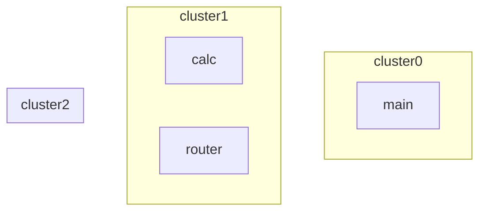

# remote-primes

## 一、跨集群质数计算介绍

- 在多个计算集群上，协作完成[1..n]区间内的质数数量计算。
- 展示scalebox具有协调分布在跨广域网的多个计算资源，完成同一计算的能力。
- 结合scalebox的节点本地计算模式、高效打包数据加载、基于路由模块可编程特性，为高I/O的计算提供完善解决方案。

质数计算应用[app-primes](../app-primes/)是scalebox的一个应用示例。

## 二、跨集群应用设计

主应用、远端子应用都需基于路由模块实现。

跨集群质数计算则将计算模块转移到一个专门的集群上完成。


### 2.1 主应用

仅包含主路由模块。

- 主路由模块功能
  - 任务分解：将计算区间分为若干个子区间，转发给子计算集群做实际计算
  - 结果汇总：将子区间计算的中间结果做累加计数

### 2.2 远端子应用
包括路由模块、计算模块。

- 路由模块：完成基于路由的任务转发。
  - 将来自主路由的任务，转发给计算模块
  - 将计算模块的子区间结果，转发回主路由
- 计算模块：实际算法，子区间内质数数量计算。

## 三、完整操作过程

- 在所有scalebox执行环境runtime实例的头节点上，完成集群及应用的创建。
  - 在每个runtime实例上，都需做集群创建
  - 在主集群的实例上，完成所有的应用创建步骤

## 3.1 创建集群

- 实验环境共有3个集群，分布在3个runtime实例上
  - cluster0为主集群
  - cluster1/cluster2为计算子集群

```sh
scalebox cluster create cluster0.yaml
scalebox cluster create cluster1.yaml
scalebox cluster create cluster2.yaml
```

### 3.2 创建应用本身

- 在主集群头节点上，创建当前本地主应用。

```sh
app_id_0=$(scalebox run --app-file main.yaml | cut -d':' -f2 | tr -d '}')
```

- 在主集群头节点上，依次创建远端子应用

```sh
app_id_1=$(CLUSTER=cluster1 scalebox run --app-file calc.yaml --main-app-id=$app_id_0| cut -d':' -f2 | tr -d '}' )
app_id_2=$(CLUSTER=cluster2 scalebox run --app-file calc.yaml --main-app-id=$app_id_0| cut -d':' -f2 | tr -d '}' )
```

### 3.3 设置应用为运行状态

```sh
scalebox app set-status --remote-cluster=cluster1 --app-id=$app_id_1 RUNNING
scalebox app set-status --remote-cluster=cluster2 --app-id=$app_id_2 RUNNING

scalebox app set-status --app-id=$app_id_0 RUNNING
```

### 3.4 给主应用分配初始任务

计算[1..1000]范围内的质数数量，分为10个子区间做计算。

```sh
echo '1000' | scalebox task add --app-id=$app_id_0
```

### 3.5 检查计算结果

```sh
scalebox semaphore get --app-id=$app_id_0 app-primes:sum_value
```

## 四、问题与讨论

### task-add中模块标识方式

| type       | module_id | app_id  | sink_module | remote_cluster |  说明                          |
| ---------- | --------- | ------- | ----------- | -------------- | ----------------------------- |
| direct     | yes       | no      | no          |  no            | 仅用于容器外测试                 |
| app-first  | yes       | yes     | no          |  no            | 用于算法模块（指向主路由或首模块）  |
| app-ref    | yes       | yes     | yes         |  no            | 用于主路由模块，向算法模块分发任务  |
| remote-app | yes       | yes     | no          |  yes           | 跨集群应用，不同主路由模块间分发任务|


| 参数            | 命令行参数      | 环境变量         |
| -------------- | -------------- | -------------- |
| module_id      | module-id      | MODULE_ID      |
| app_id         | app-id         | APP_ID         |
| sink_module    | sink-module    | SINK_MODULE    |
| remote_cluster | remote-cluster | REMOTE_CLUSTER |

- 命令行参数优先
- 模块的缺省定义中，已包含环境变量APP_ID、MODULE_ID，简化task-add命令的参数使用
