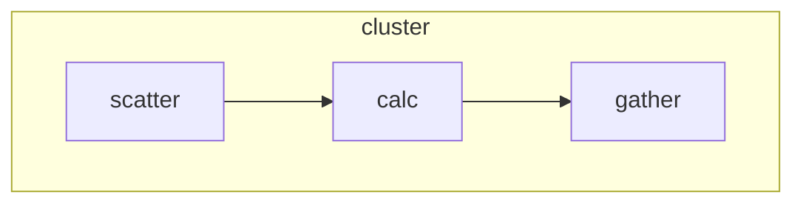
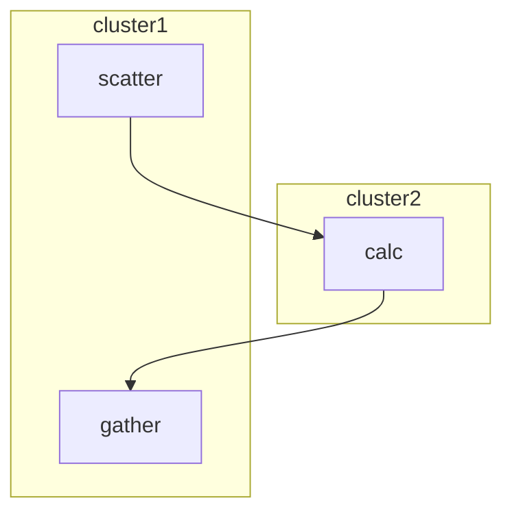

# 跨集群质数计算

质数计算应用[app-primes](../../examples/app-primes/)是scalebox的一个应用示例。
其模块的结构示意图如下：

跨集群质数计算则将计算模块转移到一个专门的集群上完成。


通过scalebox支持，实现跨物理集群的质数计算。

## 1. 跨集群的应用配置

- 按每个物理集群一个配置文件的要求，将原应用模板文件[app.yaml](../../examples/app-primes/app.yaml)拆分为cluster1.yaml、cluster2.yaml。
- 在cluster1.yaml的scatter配置中，加入指向cluster2集群的配置
```yaml
  scatter:
    environments:
      - REMOTE_SERVER=${SERVER_2}
      - APP_ID=${APP_ID_2}
```
- 在cluster2.yaml的calc配置中，加入指向cluster1集群的配置
```yaml
  calc:
    environments:
      - REMOTE_SERVER=${SERVER_1}
      - APP_ID=${APP_ID_1}
```
- 在模板参数文件scalebox.env中，加入以下参数变量定义
```
SERVER_1=10.0.6.100
APP_ID_1=

SERVER_2=10.0.6.104
APP_ID_2=
```
参数变量APP_ID_1、APP_ID_2可暂时不定义，在创建是自动获取。

## 2. 跨集群应用的启动运行

-  定义两个集群头节点的IP地址
```sh
export SERVER_1=10.0.6.100
export SERVER_2=10.0.6.104
```
- 动态获取两个集群的最新可用app-id
```sh
export APP_ID_1=`PGHOST=${SERVER_1} scalebox app get-next-id`
export APP_ID_2=`PGHOST=${SERVER_2} scalebox app get-next-id`
```
- 在集群2上，启动calc模块；在集群1上，启动scatter+gather模块
```sh
PGHOST=${SERVER_2} GRPC_SERVER=${SERVER_2} scalebox app create --debug cluster2.yaml
PGHOST=${SERVER_1} GRPC_SERVER=${SERVER_1} scalebox app create --debug cluster1.yaml
```
## 3. 计算结果查看
通过以下命令行或gui，检查计算结果的有效性
```
scalebox app list
```
